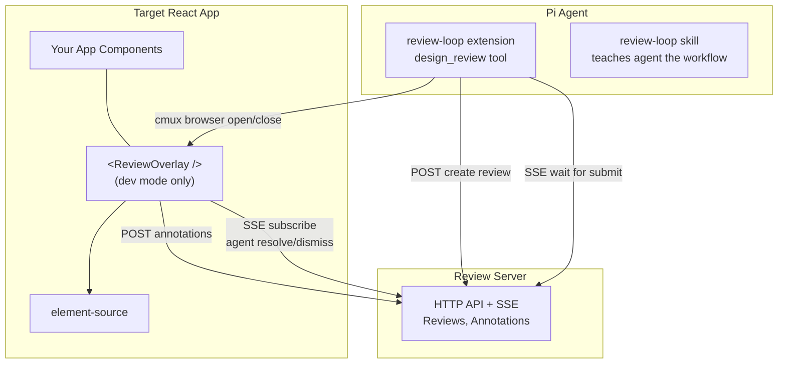
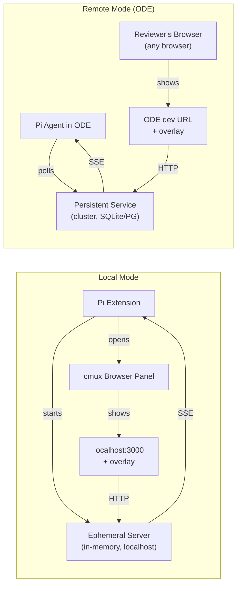
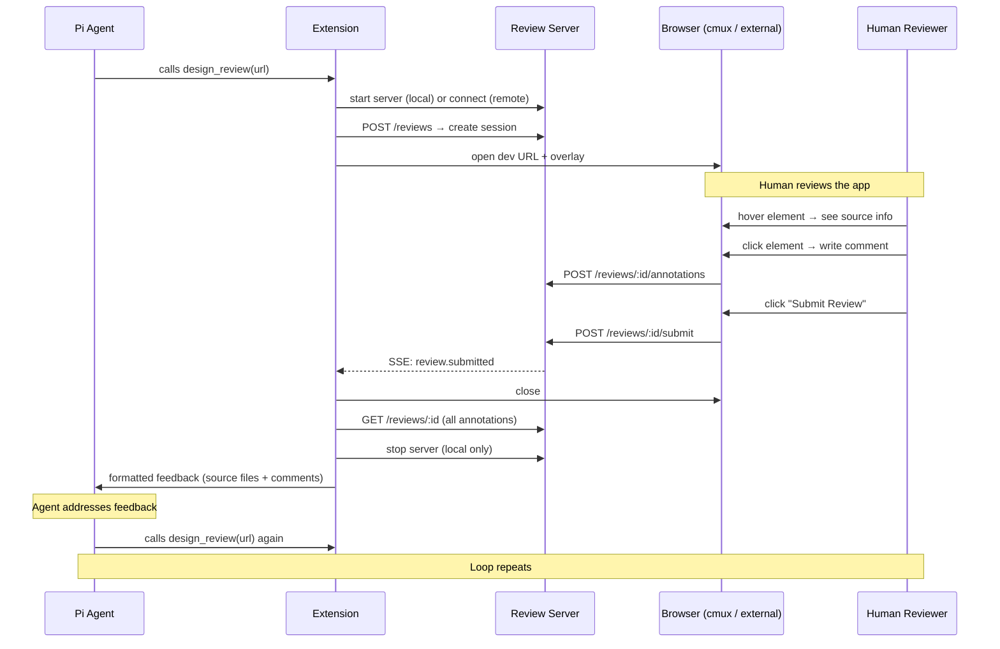

# Design Review Loop — Overview

## What

A feedback loop between agent and human for frontend/design work:

1. Agent finishes FE implementation
2. Browser opens showing the running app with a review overlay
3. Human hovers elements → sees source file/component info
4. Human clicks elements → writes feedback comments
5. Human submits review
6. Browser closes, agent receives structured feedback (comments mapped to source files)
7. Agent addresses feedback, optionally loops back to step 2

## Why

Today, giving visual/design feedback to an agent means describing things in chat ("the button looks wrong on mobile") or pasting screenshots. The agent has to guess which element and which file you mean. This loses the critical link between what the human sees and what the agent can edit.

With this loop, every piece of feedback carries: source file path, line number, component name, CSS selector, and the human's comment. The agent knows exactly where to go.

## Research Done

### Libraries evaluated

| Library | What it does | Verdict |
|---|---|---|
| **[element-source](https://element-source.com)** | Low-level: `resolveElementInfo(domElement)` → `{ filePath, lineNumber, componentName, stack }`. React, Vue, Svelte, Solid. | **Use as foundation** — gives us the hard part (DOM → source) |
| **[agentation](https://agentation.dev)** | Full system: toolbar UI + MCP server + HTTP API + webhooks + annotation schema | **Don't use** — assumes MCP, owns the backend, less control |

### cmux browser capabilities

cmux's browser panels use **WKWebView** (Apple WebKit). The `cmux browser` CLI provides Playwright-style automation:

- `cmux browser open-split <url>` — open browser panel
- `cmux browser <surface> snapshot` — accessibility tree
- `cmux browser <surface> eval <js>` — execute JavaScript
- `cmux browser <surface> click/fill/wait` — DOM interaction
- Full REST + SSE via Unix socket (`/tmp/cmux.sock`)

Terminal side uses **Ghostty** as the underlying terminal engine.

### Pi extension capabilities

- `pi.registerTool()` — register tools the LLM calls (this is how `design_review` would work)
- `pi.registerCommand()` — register `/review` slash command
- `pi.exec()` — run shell commands (cmux CLI)
- `pi.on("session_shutdown")` — cleanup hooks
- `ctx.ui.notify/confirm/select` — user interaction
- No MCP support — all integration must be HTTP/SSE

## Architecture

### Three pieces



### Two modes



### The review flow



### What the agent receives

Each annotation carries enough context for the agent to go directly to the right file:

```
## Design Review — 3 annotations

### 1. button.submit-btn [blocking · bug]
Source: src/components/FormActions.tsx:42:5
Component: App > Dashboard > FormActions > SubmitButton
Path: .form-container > .actions > button.submit-btn
Feedback: Button text should say "Save" not "Submit"

### 2. div.hero-image [important · design]
Source: src/components/Hero.tsx:18:3
Component: App > Hero > HeroImage
Feedback: Image is stretched on mobile viewport

### 3. span.nav-label [suggestion · content]
Source: src/components/Sidebar.tsx:28:12
Selected text: "Settigns"
Feedback: Typo — should be "Settings"
```

## Key Decisions Made

| Decision | Rationale |
|---|---|
| Use element-source, not agentation | Need our own backend, no MCP, more control over UX |
| HTTP + SSE, no MCP | Pi doesn't support MCP; HTTP/SSE works locally and remotely |
| Local = ephemeral in-memory server | No reason to hit a remote service when everything is on localhost |
| Remote = persistent always-on service | ODE agent and human reviewer may be different processes/machines |
| Build custom overlay UI | Full control over the review experience, can evolve independently |

## Open Questions

1. **Where do packages live?** — `packages/review-overlay/` and `packages/review-service/` in this repo? Or separate repos? This repo is a pi package (extensions + skills). Adding deployable services is new territory.

2. **Screenshot capture per annotation?** — element-source gives source location. A screenshot of the element region could help the agent understand visual issues. Adds complexity.

3. **Multi-page annotations?** — If user navigates between pages, do annotations persist and display across URLs? Or scoped to current page?

4. **Review timeout?** — How long does the `design_review` tool block waiting for review? Configurable? Default? No timeout?

5. **Hands-free mode (v2)?** — Agent processes annotations as they arrive in real-time, instead of waiting for "Submit". Worth designing for upfront?

6. **Overlay injection method?** — Currently assumes `<ReviewOverlay />` is added to the React app source. Alternatively, the extension could inject the overlay via `cmux browser eval` (no app changes needed). Tradeoff: source-in-app is cleaner but requires modifying each project; injection is zero-config but fragile.

7. **Non-React support?** — element-source supports Vue, Svelte, Solid. The overlay UI would be React-only in v1. Should we design the overlay to be framework-agnostic from the start (web component)?
